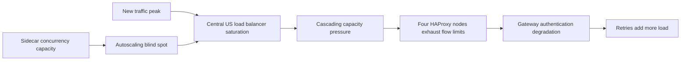
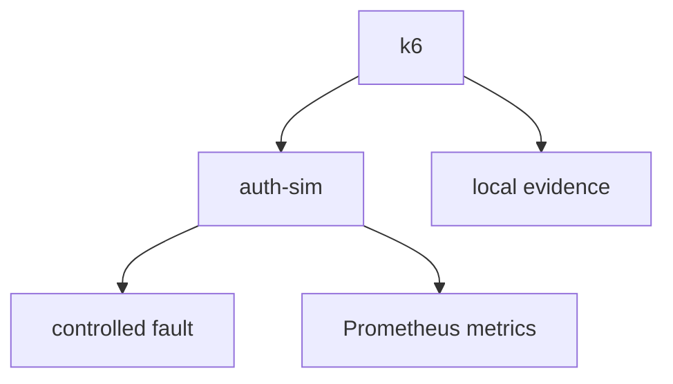

# GitHub Capacity Cascade Lab

> A reproducible SRE lab inspired by GitHub's August 17, 2026 capacity incident.

**What happens when failures generate more traffic than users?**

## Why this project?

용량 한계 자체보다 위험한 순간은 실패가 retry를 만들고, retry가 더 많은 실제 요청을
만들어 복구 여유까지 소진할 때다. 이 저장소는 그 효과를 작은 단계로 분해해 관찰하고,
완화책을 동일 조건에서 비교하기 위한 개인 SRE / Platform Engineering Lab이다.

## Incident summary

GitHub의 공개 RCA에 따르면 2026-08-17 13:28–21:15 UTC 동안 7시간 47분의
장애가 발생했다. 새로운 traffic peak에서 Central US load balancer network가
saturation에 도달했고, Istio sidecar pod의 concurrency limit과 이를 충분히 반영하지
못한 autoscaling policy에서 시작된 capacity pressure가 연쇄 확산됐다. 네 HAProxy
node의 flow limit 소진, gateway authentication path 저하, optimistic retry가 함께
부하를 악화시켰다. 복구 중에는 VS Code의 잠재된 retry behavior가 Copilot Token
Service 요청을 약 10배 증폭시켰다.

공식 출처:

- [GitHub Status — Incident with GitHub.com](https://www.githubstatus.com/incidents/zkxwbgr0cnmx)
- [The August 17 outage, and the work ahead](https://github.blog/news-insights/company-news/the-august-17-outage-and-the-work-ahead/)

## Source integrity and disclaimer

이 프로젝트는 GitHub의 비공개 내부 아키텍처를 복제한다고 주장하지 않는다.

- `FACT`: GitHub 공식 RCA에서 직접 확인된 내용
- `INFERENCE`: 공개 자료를 기반으로 한 해석이며 공식 확인되지 않은 내용
- `LAB_IMPLEMENTATION`: failure effect를 측정하기 위해 이 저장소가 선택한 구현
- `UNKNOWN`: GitHub가 공개하지 않아 확인할 수 없는 내용

Go `auth-sim`은 GitHub Token Service가 아니며, application `max_in_flight`는 Istio
sidecar concurrency limit 복제가 아니다. k6 retry도 GitHub gateway 또는 VS Code의
실제 algorithm을 구현하지 않는다. 세부 분류는
[facts-and-assumptions](docs/facts-and-assumptions.md)에 기록한다.

## Public RCA failure chain

다음은 공개 RCA의 failure effect 요약이며 정확한 network topology 도면이 아니다.



## Current phase — L00

현재 구현 범위는 **L00 — Minimal Workload and k6**다.

- Go 1.26 `net/http` 기반 `auth-sim`
- loopback 기본값을 가진 public/admin server 분리
- runtime latency, deterministic error, application admission limit
- bounded bad/good retry를 비교하는 k6 scenario
- logical request와 physical attempt의 분리 측정
- timestamp별 local evidence와 Prometheus application metrics
- multi-stage, non-root, `scratch` Docker image

## Current L00 architecture



현재 저장소에는 HAProxy, Toxiproxy, Envoy, Istio, Kubernetes, HPA 또는 Azure
resource가 없다.

## Local quick start

필수 도구는 Git, Go 1.26 이상, k6, Make다. Docker target에는 Docker daemon이
추가로 필요하다.

```bash
make doctor
make verify
make scenario SCENARIO=baseline
make scenario SCENARIO=latency
make scenario SCENARIO=bad-retry
make scenario SCENARIO=good-retry
```

`make verify`는 format check, `go vet`, Go test/build, 모든 k6 script inspect, 짧은
smoke를 수행한다. 장시간 scenario나 Docker 검증은 포함하지 않는다. 기본 public
address는 `127.0.0.1:8080`, admin address는 `127.0.0.1:9090`이며 `LAB_PUBLIC_ADDR`,
`LAB_ADMIN_ADDR`로 변경할 수 있다.

직접 실행할 때 fault mutation을 활성화하려면 secret을 환경으로만 전달한다.

```bash
export LAB_ADMIN_TOKEN='replace-with-a-local-secret'
make run
```

`LAB_ADMIN_TOKEN`이 없으면 `PUT /admin/fault`는 안전하게 실패한다. Remote
`ADMIN_URL`에 대한 mutation은 `ALLOW_REMOTE_FAULTS=1`을 명시하지 않으면 k6가
실행을 중단한다.

### Docker

```bash
make docker-build
make docker-smoke
```

기본 주소는 container 내부 loopback이므로 직접 port publish할 때 listen address를
명시해야 한다. Admin port는 host loopback에만 publish한다.

```bash
export LAB_ADMIN_TOKEN='replace-with-a-local-secret'
docker run --rm \
  --env LAB_PUBLIC_ADDR=0.0.0.0:8080 \
  --env LAB_ADMIN_ADDR=0.0.0.0:9090 \
  --env LAB_ADMIN_TOKEN \
  --publish 127.0.0.1:8080:8080 \
  --publish 127.0.0.1:9090:9090 \
  capacity-cascade/auth-sim:dev
```

## Available k6 scenarios

| Scenario | Fault | Retry policy | Purpose |
| --- | --- | --- | --- |
| `smoke` | none | none | health, readiness, token JSON, counters의 strict check |
| `baseline` | none | none | 낮은 constant arrival rate 기준선 |
| `latency` | fixed latency | none | latency와 1:1 attempt 관계 관찰 |
| `bad-retry` | deterministic error profile | 최대 5회 즉시 retry | 제한은 있지만 공격적인 실험용 비교군 |
| `good-retry` | bad와 같은 profile | 최대 3회, 분류·backoff·jitter | bounded retry trade-off 비교 |

모든 duration, logical rate, fault 값과 retry 설정은 환경변수로 override할 수 있다.
기본값은 개발자 노트북에서 빠르게 끝나는 `target` 설정이며 GitHub의 실제 설정값이
아니다.

## Evidence structure

각 wrapper 실행은 기존 경로를 덮어쓰지 않고 다음을 만든다.

```text
results/<scenario>/<UTC timestamp>/
├── metadata.json
├── k6-summary.json
├── summary.md
└── app.log
```

metadata는 선택된 실행 조건과 tool/version만 저장하며 admin token, 전체 environment,
credential 또는 개인 절대 경로를 저장하지 않는다. 생성 결과는 기본적으로 Git에서
제외한다. 자세한 비교 원칙은 [experiment policy](docs/experiment-policy.md)를 따른다.

## Application metrics

`GET /metrics`는 다음 low-cardinality metric을 노출한다.

- `capacity_cascade_http_requests_total`
- `capacity_cascade_http_request_duration_seconds`
- `capacity_cascade_http_in_flight`
- `capacity_cascade_fault_injections_total`
- `capacity_cascade_admission_rejections_total`

Request ID, token, 임의 URL 또는 사용자 입력은 label로 사용하지 않는다.

## Learning roadmap

L00부터 L10까지가 core이며 L11–L12는 optional extension이다. 다음 단계는
**L01 — HAProxy and Toxiproxy Fundamentals**다. 모든 단계의 학습 질문과 완료 기준은
[roadmap](docs/roadmap.md)에 있으며 후속 기술은 현재 모두 `Planned`다.

## Experiments

L00는 retry amplification을 다음 식으로 계산할 수 있는 harness를 제공한다.

```text
Retry Amplification = Physical Attempts / Logical Requests
```

실제 비교는 동일 workload, duration, fault timing, seed, version을 고정한 뒤 수행한다.

## Results — Planned

반복 가능한 portfolio comparison은 아직 `Planned`다. 첫 local run의 머신 종속 수치를
README에 고정하지 않는다.

## Mitigations — Planned

Retry budget, capacity-aware scaling, load shedding, progressive recovery 비교는 후속 단계의
`Planned` 작업이다.

## Azure validation — Planned

AKS resource, SKU, topology 또는 비용 가정은 아직 확정하지 않았다. L09에서 별도
preflight와 승인 경계를 거쳐 검증한다.

## Demo — Planned

재현 스크립트, 시각 자료, 발표 흐름과 최종 evidence package는 L10에서 구성한다.

## Repository status

- Current: L00 implementation
- Next: L01 — HAProxy and Toxiproxy Fundamentals
- Go module: `example.com/demo-github-capacity-cascade` (remote가 없어 사용하는 placeholder)
- Push/merge/CI: 이 단계의 범위 아님
