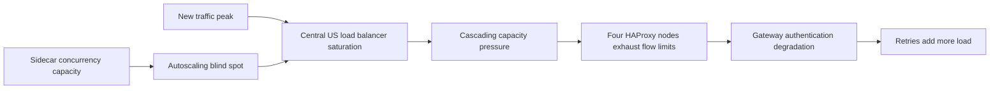
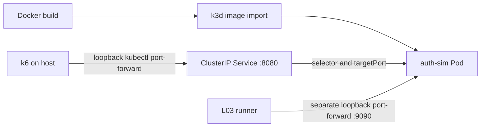
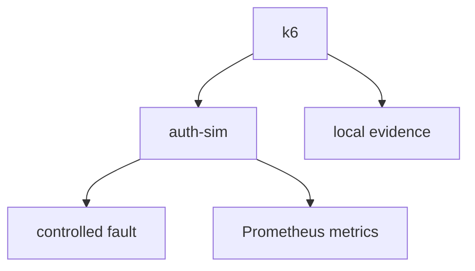

# GitHub Capacity Cascade Lab

> A reproducible SRE lab inspired by GitHub's August 17, 2026 capacity incident.

**What happens when failures generate more traffic than users?**

## Why this project?

용량 한계 자체보다 위험한 순간은 실패가 retry를 만들고, retry가 더 많은 실제 요청을
만들어 복구 여유까지 소진할 때다. 이 저장소는 그 효과를 작은 단계로 분해해 관찰하고,
완화책을 동일 조건에서 비교하기 위한 개인 SRE / Platform Engineering Lab이다.

## Incident summary

GitHub의 공개 RCA에 따르면 2026-08-17 13:28–21:15 UTC 동안 7시간 47분의
장애가 발생했다. 새로운 traffic peak에서 Central US load balancer network가
saturation에 도달했고, Istio sidecar pod의 concurrency limit과 이를 충분히 반영하지
못한 autoscaling policy에서 시작된 capacity pressure가 연쇄 확산됐다. 네 HAProxy
node의 flow limit 소진, gateway authentication path 저하, optimistic retry가 함께
부하를 악화시켰다. 복구 중에는 VS Code의 잠재된 retry behavior가 Copilot Token
Service 요청을 약 10배 증폭시켰다.

Primary incident sources:

- [GitHub Status — Incident with GitHub.com](https://www.githubstatus.com/incidents/zkxwbgr0cnmx)
- [The August 17 outage, and the work ahead](https://github.blog/news-insights/company-news/the-august-17-outage-and-the-work-ahead/)

Source별 supports/does-not-support와 freshness는 [source register](docs/source-register.md),
공개된 UTC event와 recovery 순서는 [incident timeline](docs/incident-timeline.md)에 있다.
Reliability program, historical architecture와 component documentation은 context이며 위
incident의 개별 FACT를 대신 입증하지 않는다.

## Source integrity and disclaimer

이 프로젝트는 GitHub의 비공개 내부 아키텍처를 복제한다고 주장하지 않는다.

- `FACT`: GitHub 공식 RCA에서 직접 확인된 내용
- `INFERENCE`: 공개 자료를 기반으로 한 해석이며 공식 확인되지 않은 내용
- `LAB_IMPLEMENTATION`: failure effect를 측정하기 위해 이 저장소가 선택한 구현
- `UNKNOWN`: GitHub가 공개하지 않아 확인할 수 없는 내용

Go `auth-sim`은 GitHub Token Service가 아니며, application `max_in_flight`는 Istio
sidecar concurrency limit 복제가 아니다. k6 retry도 GitHub gateway 또는 VS Code의
실제 algorithm을 구현하지 않는다. Claim별 세부 분류는
[facts-and-assumptions](docs/facts-and-assumptions.md)에 기록한다.

## Public RCA failure chain

다음은 공개 RCA의 failure effect 요약이며 정확한 network topology 도면이 아니다.



## Completed through L03 — next L04

현재 완료된 구현 범위는 **L03 — k3d and Helm Baseline**까지다. L04는
**Planned — next**이며, L00/L01/L02에서 만든 다음 기반은 의미를 바꾸지 않고 재사용한다.

- Go 1.26 `net/http` 기반 `auth-sim`
- loopback 기본값을 가진 public/admin server 분리
- runtime latency, deterministic error, application admission limit
- client no-retry와 logical/physical counter를 제공하는 k6 harness
- logical request와 physical attempt의 분리 측정
- timestamp별 local evidence와 Prometheus application metrics
- multi-stage, non-root, `scratch` Docker image

L03는 기존 auth-sim image를 작은 local Kubernetes baseline으로 옮긴다. HAProxy,
Toxiproxy, Envoy, Istio는 이 request path에 없다.



Cluster는 server 1개, agent 0개와 pinned `rancher/k3s:v1.35.5-k3s1` image를 사용한다.
Helm chart는 replica 1개의 Deployment와 public `ClusterIP` Service만 만든다. Admin token은
runner가 임시 Secret으로 만들고 admin port는 Service에 노출하지 않는다. Public/admin
port-forward와 Kubernetes API는 host loopback에만 bind한다. 이 topology, resource 값과
access model은 모두 `LAB_IMPLEMENTATION`/local `lab target`이며 production ingress,
GitHub Kubernetes topology 또는 production sizing을 뜻하지 않는다.

## L00 foundation architecture



L00/L01/L02/L03는 completed foundation이다. 상세 topology와 단계별 plane 경계는
[architecture](docs/architecture.md)에 있다. Istio, HPA와 Azure resource는 아직 없다.

## Local quick start

필수 도구는 Git, Go 1.26 이상, k6, Make다. Docker target에는 Docker daemon이
추가로 필요하다.

```bash
make doctor
make verify
make scenario SCENARIO=baseline
make scenario SCENARIO=latency
make scenario SCENARIO=bad-retry
make scenario SCENARIO=good-retry
make l01-doctor
make l01-check
make l01-smoke
make l01-scenario SCENARIO=haproxy-control
make l01-scenario SCENARIO=haproxy-constrained
make l01-scenario SCENARIO=toxiproxy-control
make l01-scenario SCENARIO=toxiproxy-latency
make l01-scenario SCENARIO=toxiproxy-reset-peer
make l01-verify
make l01-clean
make l02-doctor
make l02-check
make l02-smoke
make l02-scenario SCENARIO=envoy-control
make l02-scenario SCENARIO=envoy-timeout
make l02-scenario SCENARIO=envoy-retry-disabled
make l02-scenario SCENARIO=envoy-retry-bounded
make l02-scenario SCENARIO=envoy-circuit-breaker
make l02-verify
make l02-clean
make l03-doctor
make l03-check
make l03-smoke
make l03-verify
make l03-clean
```

`make verify`는 format check, `go vet`, Go test/build, 모든 k6 script inspect, 짧은
smoke를 수행한다. 장시간 scenario나 Docker 검증은 포함하지 않는다. 기본 public
address는 `127.0.0.1:8080`, admin address는 `127.0.0.1:9090`이며 `LAB_PUBLIC_ADDR`,
`LAB_ADMIN_ADDR`로 변경할 수 있다.

직접 실행할 때 fault mutation을 활성화하려면 secret을 환경으로만 전달한다.

```bash
export LAB_ADMIN_TOKEN='replace-with-a-local-secret'
make run
```

`LAB_ADMIN_TOKEN`이 없으면 `PUT /admin/fault`는 안전하게 실패한다. Remote
`ADMIN_URL`에 대한 mutation은 `ALLOW_REMOTE_FAULTS=1`을 명시하지 않으면 k6가
실행을 중단한다.

L01은 Docker Compose와 `curl`을 추가로 사용한다. `make l01-verify`는 config/static
check와 두 정상 경로의 짧은 smoke만 bounded 실행하며 전체 다섯 scenario를 자동으로
이어 실행하지 않는다. L01 기본값은 개발자 노트북에서 짧게 끝나는 `lab target`이고
`LOGICAL_RATE`, `DURATION`, `REQUEST_TIMEOUT`, `HAPROXY_SERVICE_TIME_MS`,
`TOXIPROXY_LATENCY_MS`로 override할 수 있다.

L02도 Docker Compose와 `curl`을 사용한다. `make l02-check`는 Compose, 실제
`envoyproxy/envoy:v1.39.1`의 `--mode validate`, k6 inspect와 shell syntax를 확인한다.
`make l02-smoke`와 `make l02-verify`는 `envoy-control`만 1 ops/s, 1s로 bounded 실행하며,
전체 fault scenario는 `make l02-scenario SCENARIO=...`로 각각 독립 실행한다. 기본 20
ops/s, 4s, application service time 250 ms는 짧은 local signal을 위한 `lab target`이다.

L03는 Docker, kubectl, k3d와 Helm을 추가로 사용한다. `make l03-check`는 chart lint/template,
rendered Secret 부재, pinned image, k6 inspect와 runner syntax를 확인한다. `make l03-verify`는
clean bootstrap부터 image import, Helm deploy, Deployment-driven Pod replacement, Metrics API
snapshot, 기존 L00 smoke, uninstall/delete cleanup까지 전체 lifecycle을 한 번만 실행한다.
Raw evidence는 `results/k3d-helm-baseline/<UTC timestamp>/`에 append-only로 남는다.

### Docker

```bash
make docker-build
make docker-smoke
```

기본 주소는 container 내부 loopback이므로 직접 port publish할 때 listen address를
명시해야 한다. Admin port는 host loopback에만 publish한다.

```bash
export LAB_ADMIN_TOKEN='replace-with-a-local-secret'
docker run --rm \
  --env LAB_PUBLIC_ADDR=0.0.0.0:8080 \
  --env LAB_ADMIN_ADDR=0.0.0.0:9090 \
  --env LAB_ADMIN_TOKEN \
  --publish 127.0.0.1:8080:8080 \
  --publish 127.0.0.1:9090:9090 \
  capacity-cascade/auth-sim:dev
```

## Available k6 scenarios

### L00

| Scenario | Fault | Retry policy | Purpose |
| --- | --- | --- | --- |
| `smoke` | none | none | health, readiness, token JSON, counters의 strict check |
| `baseline` | none | none | 낮은 constant arrival rate 기준선 |
| `latency` | fixed latency | none | latency와 1:1 attempt 관계 관찰 |
| `bad-retry` | deterministic error profile | 최대 5회 즉시 retry | 제한은 있지만 공격적인 실험용 비교군 |
| `good-retry` | bad와 같은 profile | 최대 3회, 분류·backoff·jitter | bounded retry trade-off 비교 |

모든 duration, logical rate, fault 값과 retry 설정은 환경변수로 override할 수 있다.
기본값은 개발자 노트북에서 빠르게 끝나는 `target` 설정이며 GitHub의 실제 설정값이
아니다.

### L01

| Scenario | Request path | Isolated condition | Expected signal |
| --- | --- | --- | --- |
| `haproxy-control` | k6 → HAProxy control → auth-sim | 넉넉한 HAProxy lab capacity | 정상 request/connection 기준선 |
| `haproxy-constrained` | k6 → HAProxy constrained → auth-sim | 낮은 HAProxy `maxconn`과 queue timeout | backend queue/capacity, 5xx, latency/failure |
| `toxiproxy-control` | k6 → Toxiproxy → auth-sim | toxic 없음 | network fault 기준선 |
| `toxiproxy-latency` | k6 → Toxiproxy → auth-sim | downstream latency toxic | HTTP/logical latency 증가 |
| `toxiproxy-reset-peer` | k6 → Toxiproxy → auth-sim | downstream TCP reset toxic | connection error와 logical failure |

HAProxy 두 scenario는 같은 workload와 auth-sim service time을 사용하며 HAProxy limit만
다르다. Toxiproxy 세 scenario는 application latency/error/admission fault를 모두 0으로
고정한다. 모두 no-retry, max attempts 1이고 HAProxy의 retry/redispatch도 꺼져 있다.
HAProxy `maxconn`/timeout과 Toxiproxy latency/reset 값은 모두 local 관찰을 위한
`lab target`이며 GitHub의 topology나 실제 설정을 나타내지 않는다.

### L02

| Scenario | Only comparison variable | Purpose |
| --- | --- | --- |
| `envoy-control` | 넉넉한 `max_requests`, route timeout 2s | listener → route → cluster → endpoint 정상 기준선 |
| `envoy-timeout` | route timeout `2s → 100ms` | 250 ms application service time보다 짧은 route timeout의 outcome |
| `envoy-retry-disabled` | retry policy 없음 | persistent application 503의 no-retry 기준선 |
| `envoy-retry-bounded` | `retry_on: 5xx`, `num_retries: 2` | 같은 503에서 bounded Envoy retry의 upstream attempt 증가 |
| `envoy-circuit-breaker` | cluster `max_requests: 100 → 1` | 같은 control workload에서 capacity rejection과 overflow signal |

모든 L02 scenario에서 k6 retry policy는 `none`, max attempts는 1이다. 따라서 client
amplification은 다음과 같이 계산하며 Envoy internal retry를 포함하지 않는다.

```text
Client Retry Amplification = k6 physical_attempts / logical_requests
Envoy Upstream Attempt Amplification = Envoy upstream attempts / logical_requests
```

- `logical_requests`: 사용자가 의도한 operation 수
- `physical_attempts`: k6가 Envoy downstream에 실제 보낸 client HTTP attempt 수
- Envoy downstream requests: listener/HCM이 client에서 받은 request 수
- Envoy upstream attempts: 최초 전달과 Envoy internal retry를 합한 cluster request 수
- auth-sim token request delta: application이 실제 완료 관찰한 `/token` request 증가량

Circuit breaker는 retry, timeout 또는 rate limit과 같은 기능이 아니다. 이 L02 pair에서는
outstanding upstream request 수를 제한해 auth-sim pressure를 줄이는 대신 일부 downstream
request에 빠른 503 rejection을 반환하는 trade-off를 관찰한다.

L02의 한계는 명확하다. 단일 local Envoy와 static bootstrap만 사용하며 TLS/mTLS,
HTTP/2·HTTP/3, gRPC, tracing, service mesh, xDS, Istio, Kubernetes와 production tuning을
다루지 않는다. 단일 run은 production benchmark나 GitHub topology 재현 evidence가 아니다.

### L03

L03 baseline은 Node Ready, Deployment Available, initial/replacement Pod name과 UID,
Service EndpointSlice, requests/limits, `kubectl top` snapshot과 L00 smoke를 함께 기록한다.
Pod restart는 container crash 횟수 증가가 아니라 `kubectl rollout restart`로 수행하는
Deployment-driven Pod replacement다. `kubectl top` 값은 단일 local snapshot이며
benchmark나 production sizing 근거가 아니다. Port-forward 경로는 ClusterIP/selector/backend
연결을 확인하지만 production ingress, external network, TLS/mTLS를 검증하지 않는다.

## Evidence structure

각 wrapper 실행은 기존 경로를 덮어쓰지 않고 다음을 만든다.

```text
results/<scenario>/<UTC timestamp>/
├── metadata.json
├── k6-summary.json
├── k6.log
├── summary.md
├── auth-sim.log
├── haproxy-stats.csv 또는 toxiproxy-state.json
├── HAProxy 또는 Toxiproxy log
└── cleanup.json
```

metadata는 선택된 실행 조건과 tool/version만 저장하며 admin token, 전체 environment,
credential 또는 개인 절대 경로를 저장하지 않는다. 생성 결과는 기본적으로 Git에서
제외한다. 자세한 비교 원칙은 [experiment policy](docs/experiment-policy.md)를 따른다.

L02는 공통 파일에 `envoy-version.txt`, before/after Envoy text/Prometheus stats,
`envoy-stats-delta.json`, before/after auth-sim Prometheus snapshot,
`auth-sim-metrics-delta.json`, `contract.json`, `envoy.log`, `cleanup.json`을 추가한다. Envoy
누적 counter는 fresh run 안의 before/after delta로만 해석한다.

L03는 `metadata.json`, `summary.md`, `contract.json`, `cleanup.json`과 함께 Kubernetes/tool
version, Node capacity/allocatable, Deployment/ReplicaSet/Pod/Service, EndpointSlice,
requests/limits, `kubectl top`, Helm lifecycle, initial/replacement Pod와 `smoke/` evidence를
남긴다. Kubeconfig 본문, Secret data, admin token과 개인 절대 경로는 저장하지 않는다.

## Application metrics

`GET /metrics`는 다음 low-cardinality metric을 노출한다.

- `capacity_cascade_http_requests_total`
- `capacity_cascade_http_request_duration_seconds`
- `capacity_cascade_http_in_flight`
- `capacity_cascade_fault_injections_total`
- `capacity_cascade_admission_rejections_total`

Request ID, token, 임의 URL 또는 사용자 입력은 label로 사용하지 않는다.

## Learning roadmap

L00부터 L10까지가 core이며 L11–L12는 optional extension이다. L00부터 L03까지는 completed
foundation이고 다음 단계는 **L04 — Istio Sidecar and Proxy Metrics** (`Planned — next`)다.
모든 단계의 학습 질문과 완료 기준은
[roadmap](docs/roadmap.md)에 있다.

## Experiments

L00는 retry amplification을 다음 식으로 계산할 수 있는 harness를 제공한다.

```text
Retry Amplification = Physical Attempts / Logical Requests
```

실제 비교는 동일 workload, duration, fault timing, seed, version을 고정한 뒤 수행한다.

## Results — Planned

반복 가능한 portfolio comparison은 아직 `Planned`다. 첫 local run의 머신 종속 수치를
README에 고정하지 않는다.

## Mitigations — Planned

Retry budget, capacity-aware scaling, load shedding, progressive recovery 비교는 후속 단계의
`Planned` 작업이다.

## Azure validation — Planned

AKS resource, SKU, topology 또는 비용 가정은 아직 확정하지 않았다. L09에서 별도
preflight와 승인 경계를 거쳐 검증한다.

## Demo — Planned

재현 스크립트, 시각 자료, 발표 흐름과 최종 evidence package는 L10에서 구성한다.

## Repository status

- Completed foundation: L00 — Minimal Workload and k6
- Completed foundation: L01 — HAProxy and Toxiproxy Fundamentals
- Completed foundation: L02 — Envoy Fundamentals
- Completed foundation: L03 — k3d and Helm Baseline (implementation verified; local exploratory evidence)
- Next: L04 — Istio Sidecar and Proxy Metrics (`Planned — next`)
- Go module: `github.com/imcherry5778-labs/github-capacity-cascade-lab`
- Push/merge/CI: 이 단계의 범위 아님
