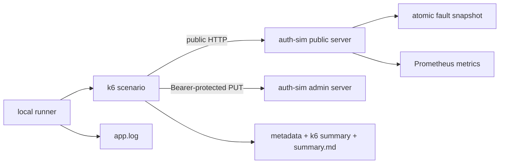
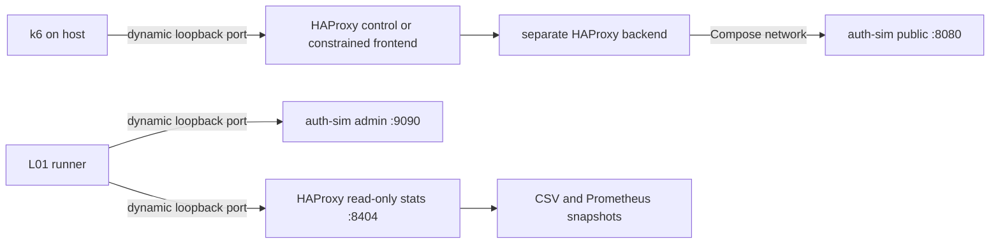
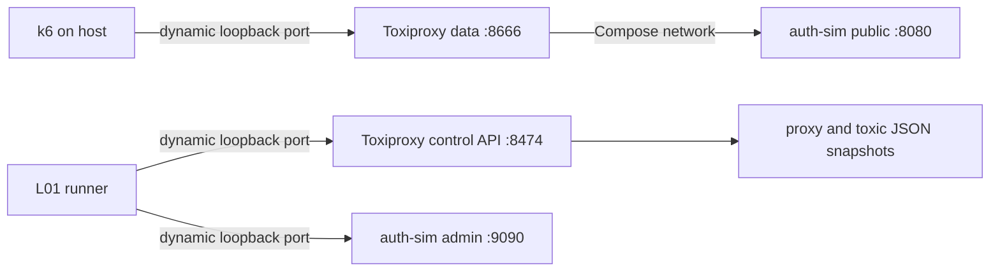
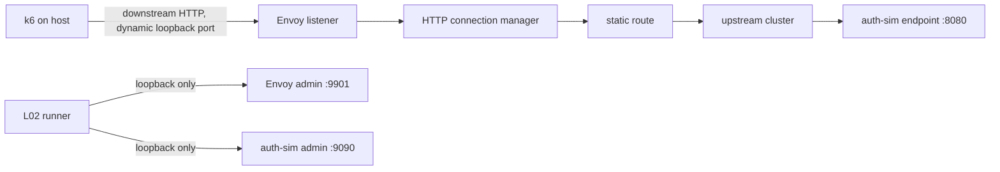

# Lab architecture

## L00 foundation

이는 `LAB_IMPLEMENTATION`이다. GitHub의 실제 service, sidecar, gateway, HAProxy 또는
network topology를 나타내지 않는다.

## Public plane

기본 listen address는 `127.0.0.1:8080`이다.

| Endpoint | Meaning | Fault affected |
| --- | --- | --- |
| `POST /token` | side-effect-free token operation simulation | yes |
| `GET /auth/status` | lab process status; 실제 인증 상태 아님 | no |
| `GET /healthz` | process와 public HTTP server liveness | no |
| `GET /readyz` | L00 initialization readiness | no |
| `GET /metrics` | Prometheus exposition | no |

`/token`은 고정 placeholder와 demo expiry를 반환한다. JWT, 사용자 정보 또는 실제 인증
기능이 없다.

## Admin plane

기본 listen address는 `127.0.0.1:9090`이며 public mux와 별도 `http.Server`를 사용한다.

- `GET /admin/fault`: 현재 immutable fault snapshot 조회
- `PUT /admin/fault`: `Authorization: Bearer <LAB_ADMIN_TOKEN>`으로 새 snapshot 교체

Admin token이 비어 있으면 mutation은 503으로 비활성화되고, 잘못된 token은 401이다.
Token은 log, metric, metadata, summary에 기록하지 않는다. Docker에서 admin listen
address를 변경해야 한다면 host publish는 loopback으로 제한한다.

## Logical request and physical attempt

- **Logical Request:** 사용자가 의도한 한 번의 token operation
- **Physical Attempt:** 최초 요청과 retry를 포함한 실제 `POST /token` 호출 한 번

각 logical operation은 `X-Lab-Logical-Request-ID`를 공유한다. 각 physical call은 1부터
증가하는 `X-Lab-Attempt`를 보낸다. bad/good 비교는 같은 iteration 기반 request ID와
fault seed를 사용한다.

## Fault processing order

`POST /token`만 다음 순서를 따른다.

1. Logical request ID와 attempt를 읽거나 안전한 기본값을 만든다.
2. 현재 fault config snapshot을 atomic load한다.
3. `max_in_flight` CAS admission을 확인하고 초과 시 기다리지 않고 503을 반환한다.
4. 허용된 request의 in-flight 수를 증가시키고 release를 `defer`한다.
5. timer와 request context로 latency를 적용한다.
6. seed, request ID, attempt의 FNV-1a hash로 deterministic error를 결정한다.
7. 성공 JSON 또는 일관된 503 JSON error를 반환한다.
8. 모든 종료 경로에서 in-flight 수를 감소시킨다.

`max_in_flight=0`은 unlimited다. 이는 application admission limit이며 Istio sidecar
concurrency 구현이 아니다. 내부 wait queue를 만들지 않는다.

## Metrics

| Metric | Type | Meaning | Labels |
| --- | --- | --- | --- |
| `capacity_cascade_http_requests_total` | Counter | fixed public route의 response 수 | `route`, `method`, `status_class` |
| `capacity_cascade_http_request_duration_seconds` | Histogram | fixed public route latency | `route`, `method`, `status_class` |
| `capacity_cascade_http_in_flight` | Gauge | admission을 통과해 실행 중인 token request | 없음 |
| `capacity_cascade_fault_injections_total` | Counter | 적용된 latency/error action | bounded `kind` |
| `capacity_cascade_admission_rejections_total` | Counter | 즉시 거절된 token request | 없음 |

Default registry와 분리된 application registry에 Go/process collector도 등록한다. Request
ID, token, 전체 URL, user input은 label로 사용하지 않는다.

## Evidence flow

Local runner는 고유 UTC result directory를 먼저 만들고 `auth-sim` stdout/stderr를
`app.log`에 연결한다. readiness 확인 후 k6를 실행하며 `handleSummary()`가 선택된
metadata, raw k6 summary, Markdown summary를 기록한다. EXIT trap은 가능한 admin
reset 후 소유한 child process를 종료한다. 기존 result directory는 덮어쓰지 않는다.

## L01 HAProxy path

한 HAProxy config에 control과 constrained frontend/backend를 따로 둔다. 두 scenario는
같은 logical rate, duration, request timeout과 auth-sim service time을 사용하고 server
`maxconn`과 `timeout queue`만 비교한다. Application `max_in_flight`는 unlimited다.
HAProxy `retries 0`과 `no option redispatch`로 proxy retry를 끄며 k6도 max attempts 1을
사용한다. 이 topology와 모든 capacity/timeout 값은 `LAB_IMPLEMENTATION`과 `lab target`이다.

## L01 Toxiproxy path

Toxiproxy path에는 HAProxy가 없다. Control은 toxic이 없고, latency는 downstream data에
고정 지연을 적용하며, connection fault는 downstream `reset_peer`로 TCP reset을 만든다.
세 경우 모두 auth-sim fault는 latency/error/max-in-flight 0이고 retry는 없다. Toxiproxy는
GitHub 실제 architecture가 아니라 network fault 주입을 위한 `LAB_IMPLEMENTATION`이다.

## L01 plane and host boundary

- Public workload plane: HAProxy frontend 또는 Toxiproxy data port 하나만 k6가 사용한다.
- Application admin plane: bearer token을 process environment로만 받고 host loopback의
  Docker 할당 port에만 publish한다.
- HAProxy stats plane: read-only stats/Prometheus endpoint이며 host loopback에만 publish한다.
- Toxiproxy control plane: proxy/toxic 생성과 reset API이며 host loopback에만 publish한다.
- Compose network: auth-sim public port는 host에 직접 publish하지 않는다.

Runner는 매 실행 고유 Compose project와 동적 host port를 사용한다. 종료 시 application
fault와 toxic을 reset해 state를 저장한 뒤 해당 project의 container/network만 제거한다.
Failed evidence도 삭제하지 않는다.

## L02 standalone Envoy path

Envoy 용어에서 downstream은 Envoy에 연결해 request를 보내는 k6 방향이고, upstream은
Envoy가 연결하고 request를 전달하는 auth-sim 방향이다.

- **Listener:** downstream client가 연결하는 이름 있는 network address/port다.
- **Route:** incoming HTTP request를 어떤 cluster로 보낼지 선택하고 timeout/retry policy를 적용한다.
- **Cluster:** Envoy가 연결하는 논리적으로 같은 upstream host 집합과 capacity policy다.
- **Endpoint:** 이 lab에서는 cluster가 실제로 연결하는 `auth-sim:8080` 한 개다.

한 Envoy process에 scenario별 listener/route/cluster를 분리한다. 각 HCM은 별도
`stat_prefix`, 각 cluster는 별도 이름을 사용하므로 downstream, upstream attempt, retry,
timeout, overflow counter가 scenario별로 섞이지 않는다.

| Scenario | Listener port inside Compose | Route timeout | Retry | Cluster max requests |
| --- | ---: | ---: | --- | ---: |
| `envoy-control` | 10000 | 2s | none | 100 |
| `envoy-timeout` | 10001 | 100ms | none | 100 |
| `envoy-retry-disabled` | 10002 | 2s | none | 100 |
| `envoy-retry-bounded` | 10003 | 2s | `5xx`, 2 retries | 100 |
| `envoy-circuit-breaker` | 10004 | 2s | none | 1 |

모든 값과 standalone topology는 local signal을 위한 `LAB_IMPLEMENTATION`/`lab target`이다.
Control/timeout과 control/circuit-breaker는 20 ops/s, 4s, auth-sim service time 250 ms를
공유한다. Retry pair는 같은 persistent 503 profile과 workload를 공유하고 route
`retry_policy`만 다르다.

## L02 observation and host boundary

- Public workload plane: k6는 선택한 Envoy listener의 dynamic loopback port만 사용한다.
- Envoy upstream plane: auth-sim public `:8080`은 Compose network 안에서만 endpoint로 사용한다.
- Application admin plane: bearer token은 process environment에만 있고 host loopback의
  dynamic port로 fault reset/apply에 사용한다.
- Envoy admin plane: host loopback의 dynamic port에서 `/ready`와 read-only `/stats`만 읽는다.
- Snapshot order: application metrics before → Envoy stats before → workload → Envoy stats
  after → application metrics after 순서로 수집해 observation request를 Envoy delta에서 뺀다.

Route timeout은 complete upstream response를 기다리는 request budget이고, cluster
`connect_timeout`은 upstream TCP connection 성립을 기다리는 별도 budget이다. Retry route의
2s timeout은 최초 attempt와 두 internal retry 전체를 포함한다.

## L02 measurement units

- k6 `logical_requests`: 사용자가 의도한 operation 수
- k6 `physical_attempts`: k6가 Envoy에 보낸 downstream HTTP attempt 수
- Envoy downstream request: HCM이 k6에서 받은 request 수
- Envoy upstream attempt: 최초 전달과 Envoy internal retry를 합한 cluster request 수
- auth-sim token request delta: application Prometheus counter가 관찰한 `/token` 완료 수

L02 k6 max attempts는 항상 1이므로 client amplification은 1x를 유지할 수 있지만,
`envoy-retry-bounded`의 upstream attempt amplification은 1x보다 커질 수 있다. Circuit
breaker rejection은 upstream으로 전달되지 않으므로 반대로 upstream attempt가 downstream
request보다 작을 수 있다.

## Planned architecture only

후속 단계에서 k3d/Helm, Istio sidecar metrics, HPA, Chaos Mesh, AKS를 순차 검토한다.
현재 architecture에는 이 구성요소가 없으며 구체 topology, resource, YAML, threshold,
cloud SKU는 아직 결정하지 않았다.
