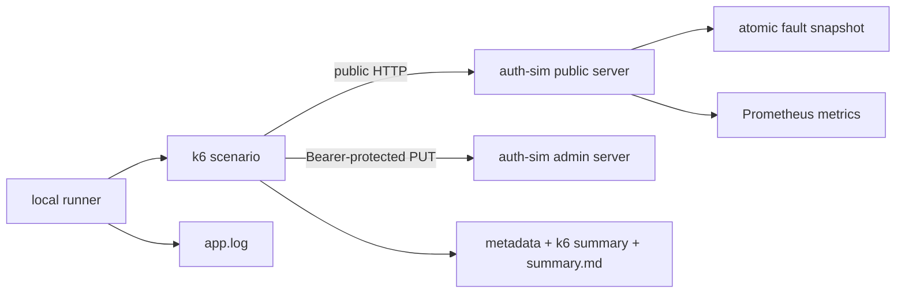

# L00 architecture

## Current structure

이는 `LAB_IMPLEMENTATION`이다. GitHub의 실제 service, sidecar, gateway, HAProxy 또는
network topology를 나타내지 않는다.

## Public plane

기본 listen address는 `127.0.0.1:8080`이다.

| Endpoint | Meaning | Fault affected |
| --- | --- | --- |
| `POST /token` | side-effect-free token operation simulation | yes |
| `GET /auth/status` | lab process status; 실제 인증 상태 아님 | no |
| `GET /healthz` | process와 public HTTP server liveness | no |
| `GET /readyz` | L00 initialization readiness | no |
| `GET /metrics` | Prometheus exposition | no |

`/token`은 고정 placeholder와 demo expiry를 반환한다. JWT, 사용자 정보 또는 실제 인증
기능이 없다.

## Admin plane

기본 listen address는 `127.0.0.1:9090`이며 public mux와 별도 `http.Server`를 사용한다.

- `GET /admin/fault`: 현재 immutable fault snapshot 조회
- `PUT /admin/fault`: `Authorization: Bearer <LAB_ADMIN_TOKEN>`으로 새 snapshot 교체

Admin token이 비어 있으면 mutation은 503으로 비활성화되고, 잘못된 token은 401이다.
Token은 log, metric, metadata, summary에 기록하지 않는다. Docker에서 admin listen
address를 변경해야 한다면 host publish는 loopback으로 제한한다.

## Logical request and physical attempt

- **Logical Request:** 사용자가 의도한 한 번의 token operation
- **Physical Attempt:** 최초 요청과 retry를 포함한 실제 `POST /token` 호출 한 번

각 logical operation은 `X-Lab-Logical-Request-ID`를 공유한다. 각 physical call은 1부터
증가하는 `X-Lab-Attempt`를 보낸다. bad/good 비교는 같은 iteration 기반 request ID와
fault seed를 사용한다.

## Fault processing order

`POST /token`만 다음 순서를 따른다.

1. Logical request ID와 attempt를 읽거나 안전한 기본값을 만든다.
2. 현재 fault config snapshot을 atomic load한다.
3. `max_in_flight` CAS admission을 확인하고 초과 시 기다리지 않고 503을 반환한다.
4. 허용된 request의 in-flight 수를 증가시키고 release를 `defer`한다.
5. timer와 request context로 latency를 적용한다.
6. seed, request ID, attempt의 FNV-1a hash로 deterministic error를 결정한다.
7. 성공 JSON 또는 일관된 503 JSON error를 반환한다.
8. 모든 종료 경로에서 in-flight 수를 감소시킨다.

`max_in_flight=0`은 unlimited다. 이는 application admission limit이며 Istio sidecar
concurrency 구현이 아니다. 내부 wait queue를 만들지 않는다.

## Metrics

| Metric | Type | Meaning | Labels |
| --- | --- | --- | --- |
| `capacity_cascade_http_requests_total` | Counter | fixed public route의 response 수 | `route`, `method`, `status_class` |
| `capacity_cascade_http_request_duration_seconds` | Histogram | fixed public route latency | `route`, `method`, `status_class` |
| `capacity_cascade_http_in_flight` | Gauge | admission을 통과해 실행 중인 token request | 없음 |
| `capacity_cascade_fault_injections_total` | Counter | 적용된 latency/error action | bounded `kind` |
| `capacity_cascade_admission_rejections_total` | Counter | 즉시 거절된 token request | 없음 |

Default registry와 분리된 application registry에 Go/process collector도 등록한다. Request
ID, token, 전체 URL, user input은 label로 사용하지 않는다.

## Evidence flow

Local runner는 고유 UTC result directory를 먼저 만들고 `auth-sim` stdout/stderr를
`app.log`에 연결한다. readiness 확인 후 k6를 실행하며 `handleSummary()`가 선택된
metadata, raw k6 summary, Markdown summary를 기록한다. EXIT trap은 가능한 admin
reset 후 소유한 child process를 종료한다. 기존 result directory는 덮어쓰지 않는다.

## Planned architecture only

후속 단계에서 HAProxy/Toxiproxy, Envoy, k3d/Helm, Istio sidecar metrics, HPA, Chaos Mesh,
AKS를 순차 검토한다. 현재 L00 architecture에는 이 구성요소가 없으며 구체 topology,
resource, YAML, threshold, cloud SKU는 아직 결정하지 않았다.
