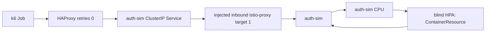
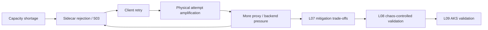

# Portfolio case study

Cloud / Platform / DevOps / SRE 면접관이 5–10분 안에 이 lab의 핵심을 읽을 수 있도록 만든
요약이다. 전체 원문 evidence는 각 절의 링크에 있으며, 이 문서 자체는 측정값을 새로
만들지 않는다. 표기 규칙은 [AGENTS.md](../AGENTS.md)와 [README](../README.md)의
`FACT`/`INFERENCE`/`LAB_IMPLEMENTATION`/`UNKNOWN` 구분을 그대로 따른다.

## 1. Research question

> 용량이 부족해지는 순간보다, 실패가 만든 retry가 추가 실제 요청을 만들어 복구 여유까지
> 소진하는 순간이 더 위험하다. 이 lab은 이 cascade effect를 재현 가능한 최소 단위로
> 분해하고, 완화책의 trade-off를 같은 조건에서 비교하며, local 결론 중 어떤 부분이
> managed Kubernetes에서도 유지되는지 검증한다.

## 2. Official GitHub incident facts

GitHub의 공개 RCA/Availability Report(2026-08-17 13:28–21:15 UTC, 7시간 47분)가 직접
지원하는 FACT만 인용한다. 전체 claim/source mapping은
[source register](source-register.md), [facts and assumptions](facts-and-assumptions.md),
[incident timeline](incident-timeline.md)에 있다.

- 새 traffic peak에서 Central US load balancer network가 saturation에 도달했다.
- Istio sidecar pod의 concurrency limit 도달과, host service만 관찰해 sidecar capacity를
  충분히 반영하지 못한 autoscaling policy가 최초 원인으로 설명됐다.
- 네 HAProxy node의 flow limit 소진과 shared gateway authentication path 저하가 뒤따랐다.
- Optimistic client/gateway retry가 부하를 악화시켰고, 복구 중에는 VS Code의 잠재된 retry
  behavior가 Copilot Token Service traffic을 약 10배(정상 7–9K RPS → 약 70–100K RPS)
  증폭시켰다.
- 복구에는 gateway retry 축소, token 요청의 일시적 403 차단, site별 점진적 traffic
  ramp-up이 사용됐다.

## 3. What we intentionally do NOT know

- GitHub의 정확한 network topology, Central US/Northern Virginia infrastructure 매핑.
- 정확한 Istio sidecar concurrency 값, HPA metric/policy, HAProxy flow limit 구현.
- Gateway와 VS Code의 정확한 retry algorithm, budget, backoff.
- 각 mitigation의 exact execution timestamp와 traffic percentage.
- GitHub가 chaos engineering 도구를 사용했는지 여부.

이 lab의 모든 topology, threshold, tool, version은 위 `UNKNOWN`을 메우기 위한
`LAB_IMPLEMENTATION` 선택이며 GitHub 사실이 아니다.

## 4. Lab decomposition

L00–L05는 이후 결론을 신뢰하기 위한 measurement foundation이다. L06–L09가 이 portfolio의
핵심 story다.

| Unit | 압축 요약 |
| --- | --- |
| L00–L03 | Logical request/physical attempt 분리 측정, proxy capacity(HAProxy)/network fault(Toxiproxy) 분리, Envoy timeout/retry/circuit-breaker 관찰 단위, k3d+Helm Kubernetes lifecycle baseline을 각각 독립적으로 만들었다. |
| L04 | 같은 Pod 안 application과 inbound Istio sidecar의 capacity 경계를 분리 관찰해 "application metric만으로 sidecar saturation을 판정할 수 없다"는 counter boundary를 세웠다. |
| L05 | L04 sidecar target을 고정한 채 HPA가 보는 metric만 바꿔, CPU-blind HPA가 sidecar overflow를 보지 못하는 scaling blind spot을 3회 반복으로 확인했다. |
| L06 | L05 blind HPA를 유지하고 HAProxy/non-injected k6를 앞에 연결해, client retry 하나만 바꿔 physical attempt/sidecar overflow/HAProxy 전파를 비교했다. |
| L07 | L06 경로에서 RCA가 지시한 네 방향(retry backoff, load shedding, capacity-aware scaling, gradual ramp)을 한 번에 하나씩 분리 비교했다. |
| L08 | 수동 fault를 선언적 Chaos Mesh `NetworkChaos`로 옮겨 fault window, blast radius, abort, cleanup을 증명했다. |
| L09 | 같은 개념적 실험을 Azure AKS managed Kubernetes에서 재현해 local 결론의 일부가 유지되는지 확인했다. |

## 5. Core architecture



이는 `LAB_IMPLEMENTATION`이며 GitHub의 실제 request path나 topology가 아니다. non-injected
k6 Job → HAProxy(`retries 0`) → ClusterIP Service → injected inbound `istio-proxy`
(`http2MaxRequests: 1`) → `auth-sim`이 L06–L09가 공유하는 최소 local path다.

이 path 위에서 관찰하는 feedback loop와, L06 이후 각 단계가 어떻게 연결되는지는 다음과
같다.



이 loop는 개념적 학습 diagram이며 GitHub의 정확한 network topology가 아니다.

## 6. L06 — cascade evidence

세 clean-source pair(no-retry max attempts 1 vs bounded immediate retry max attempts 3,
동일 stable→peak→recovery ramping-arrival-rate workload)에서:

| Metric | no-retry | retry |
| --- | --- | --- |
| Physical attempts | 219–220 | 508–513 |
| Selected sidecar active overflow | 143–144 | 430–434 |
| Retry attempts | 0 | 289–293 |
| Retry amplification | 1.0x | 2.320–2.332x |

Retry가 logical workload(고정된 220 logical requests)를 바꾸지 않은 상태에서 physical
attempts와 selected sidecar overflow를 크게 늘렸다. HAProxy가 관찰한 backend session/전달된
5xx도 같은 비율로 증가했다. 원문은 [L06 curated evidence](../results/curated/l06/README.md).
이는 fixed local mechanism evidence이며 GitHub topology, retry algorithm 또는 production
capacity를 뜻하지 않는다.

## 7. L07 — mitigation trade-offs

한 번에 하나의 mechanism만 바꾼 세 clean-source matrix의 결과다. 아래는 우열 순위가
아니라 각 mitigation의 trade-off다.

| Pair | 바뀐 것 | 개선 | 대가 |
| --- | --- | --- | --- |
| M1 retry policy | immediate retry → bounded exponential backoff+jitter | logical failure 감소 (0.635–0.641 → 0.605–0.614) | physical attempts(509–512 → 525–545), overflow(430–432 → 440–459), p95(1003–1004ms → 1096–1212ms) 증가 |
| M2 load shedding | HAProxy forwarding → per-source 1s rate 2 초과 시 429 | overflow 감소(143–144 → 46–47) | client-visible logical failure 명시적 증가(0.653–0.658 → 0.805–0.808) |
| M3 capacity-aware scaling | blind CPU HPA → L05 sidecar-active-request HPA | 실제 2/2 scale-up, overflow 감소(1/1일 때 143–144 → 56/56/71) | 별도 adapter/exporter 운용 복잡도 |
| M4 gradual ramp | steep arrival → gradual arrival | 이 fixed local condition에서 overflow 감소(156 → 143–144) | raw logical count가 일부 run에서 1 차이 — normalization 한계 |

원문은 [L07 curated evidence](../results/curated/l07/README.md). M1–M4의 값과 threshold는
모두 `LAB_IMPLEMENTATION`이며 GitHub의 실제 mitigation code나 production tuning
recommendation이 아니다.

## 8. L08 — chaos engineering safety

L08의 headline은 "cascade 재현"이 아니라 **fault의 declarative/observable/safe 제어**다.

- Chaos Mesh 2.8.4 `NetworkChaos`(delay 600ms, 25s window)를 `auth-sim` Pod에만 label
  selector로 좁혀 적용했고, HAProxy와 k6 load namespace는 namespace filter로 격리했다.
- 세 clean-source repetition에서 fault window 동안 p95가 ~1202ms로 상승하고 HAProxy
  backend session이 누적(peak 3–4)되며 503이 47–50건 발생한 뒤, fault 종료 시점에 세션
  0과 200 OK로 복귀했다.
- **Selected sidecar active overflow peak는 0**이었다 — 이 503들은 sidecar queue overflow가
  아니라 fault-induced delay와 backend timeout에서 발생했다는 뜻이다. L06/L07의 capacity
  overflow와는 다른 mechanism이다.
- Controlled abort smoke는 활성 injection 중 CR을 즉시 삭제해 잔여 CR/Pod 0을 확인했다.

원문은 [L08 curated evidence](../results/curated/l08/README.md). GitHub가 같은 도구를
사용했다는 주장이 아니다.

## 9. L09 — AKS validation

Headline은 "local 숫자를 그대로 재현했다"가 아니라 **같은 conceptual experiment가 managed
Kubernetes에서도 비슷한 mechanism을 보였다**이다.

| Metric | Local k3d (L06 평균) | Azure AKS (L09 평균) |
| --- | --- | --- |
| no-retry physical attempts | 219.3 | 219.0 |
| no-retry sidecar overflow | 143.7 | 143.7 |
| retry physical attempts | 510.3 (2.32x) | 509.3 (2.32x) |
| retry sidecar overflow | 431.7 (~3.0x) | 430.3 (~3.0x) |
| Blind HPA replicas | 1/1 | 1/1 |

- Azure AKS Free tier, 1-node `Standard_D4s_v7`, Azure CNI Overlay, self-managed Istio
  1.30.4 위에서 L06과 동일한 path/HPA/retry 비교를 3회 paired repetition으로 실행했다.
- Teardown 후 Resource Graph/CLI로 확인한 잔여 소유 resource는 0
  (`residual_owned_resources: 0`, [destroy-contract.json](../results/curated/l09/destroy-contract.json)).
- **비용:** Retail Prices API 기반 추정 지출액은 약 **$0.21 USD**(승인 예산 $2.00의
  ~10.5%)다. Azure Cost Management의 실제 observed spend는 비용 파이프라인의 24–48시간
  수집 지연으로 **아직 pending**이며, $0으로 간주하지 않는다.
- Cluster autoscaler 상호작용과 인터넷 경계 WAN latency의 복구 영향은 이 실험 범위에서
  측정하지 않았다(`UNKNOWN`).

원문은 [L09 curated evidence](../results/curated/l09/README.md). AKS를 GitHub production
환경이라고 표현하지 않는다.

## 10. Key findings

1. Client retry는 고정된 logical demand를 바꾸지 않고도 physical load와 selected sidecar
   overflow를 약 2.3배/3.0배로 증폭시켰다(L06, L09에서 동일 비율로 재현).
2. Scaling metric의 관찰 대상이 실제 bottleneck과 다르면(application CPU vs sidecar queue)
   HPA가 replica를 늘리지 않고도 capacity shortage가 지속될 수 있다(L05, L07 M3).
3. 완화책은 서로 다른 trade-off를 가진다 — backoff/jitter는 실패를 줄이지만 부하를
   늘리고, load shedding은 backend를 보호하지만 client-visible 실패를 명시적으로 늘린다
   (L07).
4. 선언적 chaos engineering으로 fault window와 신호 상관관계, 안전한 abort/cleanup을
   증명할 수 있다(L08).
5. 이 fixed lab 조건에서 mechanism-level amplification 비율은 local k3d와 managed AKS
   사이에서 거의 동일하게 관찰됐다(L09).

## 11. Limitations

- 모든 topology, threshold, tool, version은 `LAB_IMPLEMENTATION`이며 GitHub의 비공개
  infrastructure를 복제하지 않는다.
- 단일 fixed workload/조건의 최소 3회 반복이며, machine-independent benchmark나 production
  capacity 예측이 아니다.
- Mitigation 비교는 trade-off 관찰이며 보편적인 우열 순위가 아니다.
- L09는 1-node Free tier subscription quota 제약 아래 실행됐고 cluster autoscaler와
  cross-region WAN 영향은 측정하지 않았다.
- L09 actual Cost Management observed spend는 이 문서 작성 시점에 pending이다.

## 12. Evidence claim map

| # | Claim | Source label | Evidence | Limitation |
| --- | --- | --- | --- | --- |
| 1 | GitHub RCA는 sidecar concurrency limit을 반영하지 못한 autoscaling과 HAProxy flow 소진, client/gateway retry 증폭을 원인으로 설명한다 | `FACT` | [source register](source-register.md) (RCA-01/02/03) | 이 lab의 mechanism 연구 동기일 뿐, lab이 이를 재현했다는 증거가 아니다 |
| 2 | Blind CPU HPA는 desired/current 1/1에 머물고 sidecar overflow가 336–337에 도달, capacity-aware HPA는 2/2로 scale-up하며 overflow가 151–176로 개선됐다 | `MEASURED EVIDENCE` | [L05 curated evidence](../results/curated/l05/README.md) | 하나의 fixed lab 조건, GitHub HPA 설정이 아님 |
| 3 | Client retry만 바꿨을 때 physical attempts가 219→508–513, sidecar overflow가 143→430–434로 증가했다 | `MEASURED EVIDENCE` | [L06 curated evidence](../results/curated/l06/README.md) | Fixed local mechanism evidence, GitHub 10x/topology 주장 아님 |
| 4 | Backoff+jitter는 logical failure를 줄이지만 physical attempts/overflow/p95를 늘린다 | `MEASURED EVIDENCE` | [L07 curated evidence](../results/curated/l07/README.md) M1 | 세 fixed local matrix, 보편적 retry 권고 아님 |
| 5 | HAProxy 429 shedding은 overflow를 줄이지만 client-visible failure를 명시적으로 늘린다 | `MEASURED EVIDENCE` | [L07 curated evidence](../results/curated/l07/README.md) M2 | Local threshold(2/s)만의 관찰, GitHub 403 구현과 무관 |
| 6 | Capacity-aware HPA는 blind HPA보다 실제로 scale-up하고 overflow를 줄인다 | `MEASURED EVIDENCE` | [L07 curated evidence](../results/curated/l07/README.md) M3 | Local adapter/metric 선택에 한정 |
| 7 | Chaos Mesh fault window(25s) 동안 p95/503가 상승하고 종료 시 0 세션으로 복귀했으며, sidecar overflow peak는 0이었다 | `MEASURED EVIDENCE` | [L08 curated evidence](../results/curated/l08/README.md) | Mechanism-level reproduction, GitHub chaos 도구 사용 주장 아님 |
| 8 | Controlled abort는 CR을 즉시 삭제하고 잔여 CR/Pod 0을 남긴다 | `MEASURED EVIDENCE` | [L08 curated evidence](../results/curated/l08/README.md) abort-smoke | 로컬 cleanup 계약 검증일 뿐 |
| 9 | Azure AKS에서 retry 증폭 비율(~2.32x physical, ~3.0x overflow)이 local k3d와 거의 동일하게 재현됐다 | `MEASURED EVIDENCE` | [L09 curated evidence](../results/curated/l09/README.md) §2–3 | 1-node Free tier, single fixed condition, production parity 주장 아님 |
| 10 | L09 teardown 후 잔여 소유 Azure resource는 0이다 | `MEASURED EVIDENCE` | [destroy-contract.json](../results/curated/l09/destroy-contract.json) | 이 run에 한정된 검증 |
| 11 | L09 retail-price 기반 추정 지출액은 약 $0.21 USD이고, 실제 Cost Management observed spend는 pending이다 | `MEASURED EVIDENCE` / boundary | [L09 curated evidence](../results/curated/l09/README.md) §7 | 확정 청구액이 아님; pending을 $0으로 간주하지 않음 |
| 12 | Application-CPU 관찰만으로는 sidecar 쪽 capacity 소진을 판정할 수 없다 | `INFERENCE` | [facts-and-assumptions](facts-and-assumptions.md) I01/I03 | GitHub의 정확한 HPA 설정을 뜻하지 않음 |

## 13. Reproduce / inspect evidence

```bash
make doctor
make verify
make l06-doctor
make l06-check
make l06-smoke      # 빠른 bootstrap/datapath/cleanup 확인 — portfolio evidence 아님
make l06-verify      # 단일 no-retry/retry live pair — portfolio evidence 아님
make l10-check        # portfolio package 정합성 검증
```

Portfolio claim은 위 명령이 만드는 새 run이 아니라 이미 curated된 3회 반복
(`results/curated/l05`–`l09`)을 authority로 사용한다. 각 curated README는 raw source
directory, 반복 횟수, contract PASS/FAIL을 함께 기록한다.

## 14. Demo entry point

Live/evidence-only demo 흐름, 청중 signal, 시간 배분과 실패 fallback은
[docs/demo-runbook.md](demo-runbook.md)에 있다.
